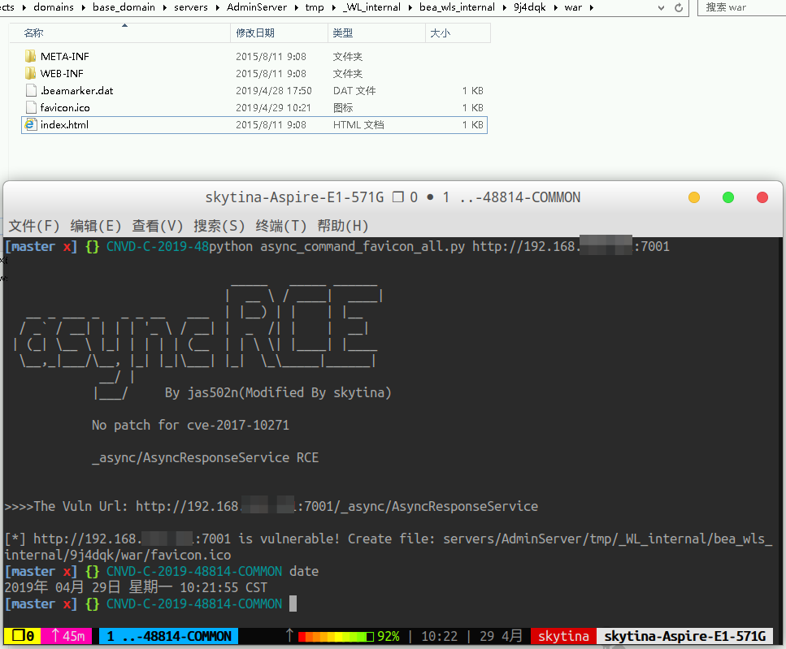
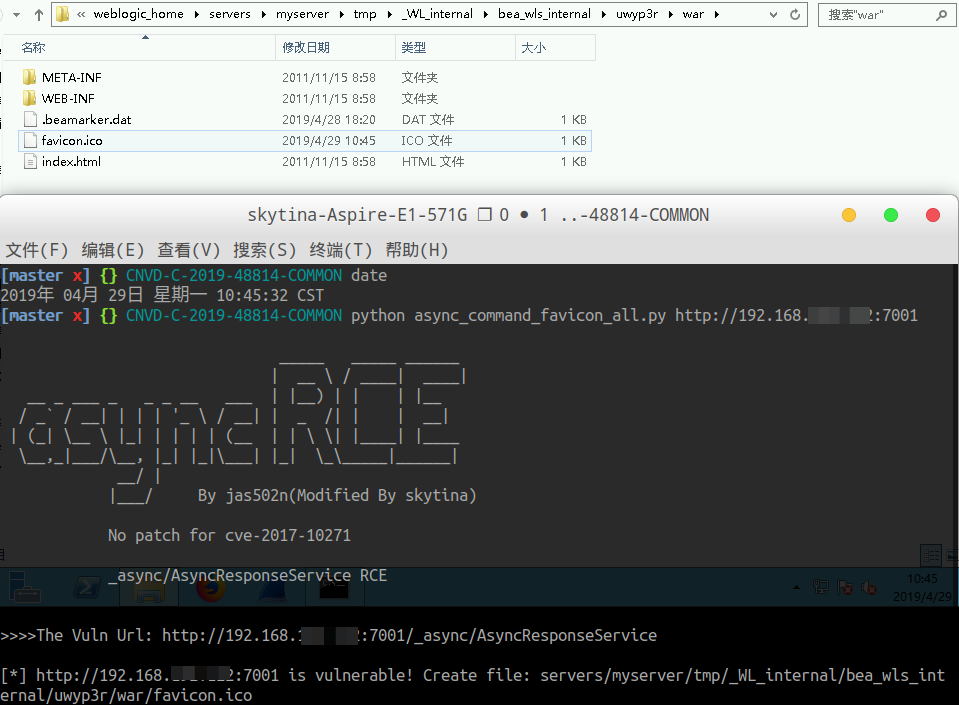
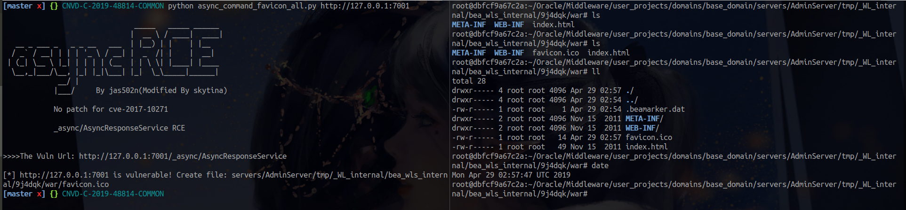

# CNVD-C-2019-48814 work on linux and windows(CVE-2019-2725)
WebLogic wls9-async反序列化远程命令执行漏漏洞

# 说明
- **It's does't work when weblogic patched for cve-2017-10271**
  - [x] 10.3.6.0
  - [x] 12.1.3.0
  
基于[jas502n](https://github.com/jas502n/CNVD-C-2019-48814/blob/master/cve-2017-10271/async\_command\_favicon.py)的脚本修改而成

# 使用
python async_command_favicon_all.py http://127.0.0.1:7001

# 漏洞复现

## 1. Windows Server 2012
  - servers/AdminServer/tmp/_WL_internal/bea_wls_internal/9j4dqk/war/favicon.ico

## 2. Windows Server 2012
  - servers/myserver/tmp/_WL_internal/bea_wls_internal/uwyp3r/war/favicon.ico
    - when you create WLS domain **with terminal**, it will create **myserver** instead of **AdminServer** which create WLS domain by invoking the GUI configurationwizard.

## 3. Linux
  - servers/AdminServer/tmp/_WL_internal/bea_wls_internal/9j4dqk/war/favicon.ico
  

# 参考链接

[Weblogic反序列化远程代码执行漏洞（CVE-2019-2725）分析报告](https://www.anquanke.com/post/id/177381)

[Bypass patch for CVE-2017-10271](https://mp.weixin.qq.com/s/NBwqF4GZBGQKZHTHx85N8A)

[Oracle Security Alert Advisory - CVE-2019-2725](https://www.oracle.com/technetwork/security-advisory/alert-cve-2019-2725-5466295.html#AppendixFMW)
